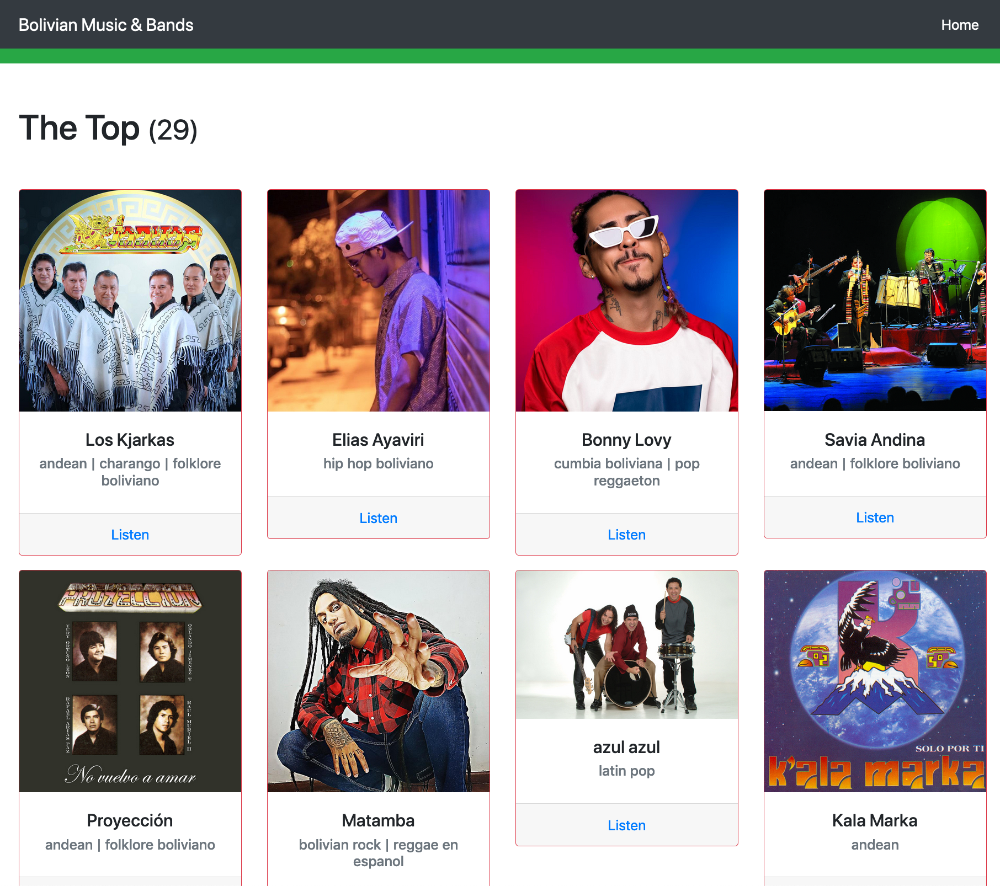

# Bolivian Artists Recommender
### Sistema de recomendación de Música Boliviana

Bolivian musicians are very talented but unfortunately they're not given the attention they deserve. This data-based project aims to promote bolivian artists and make them more visible for locals and the world.

The project consists in:
- The construction of a dataset of bolivian artists by fetching public Spotify data.

- The application of data clustering techniques to segment the collected data and gain
  artists description.
- The implementation of a web app for artist recommendations.

## Dependencies

- Python 3
- Jupyter Notebook
- Spotipy
- Pandas
- Numpy
- Matplotlib
- Flask
- Bootstrap 4.5

## Project Files and Folders
- `Capstone-Project.ipynb`: Jupyter Notebook containing Problem Definition, Data Analysis,
  Methodology, Results and Conclusion of the project in general and the artists segmentation.
#### App
- `server.py`: is the main file of the web app
-  `templates`, and `static`: folders contain views and web resources.
#### Data
- `playlist_collector.py`: Pulls and transforms playlist data (from Spotify API) containing the word
  'Bolivia' in their name or description.
- `artists_collector.py`: Pulls and transforms artists data from a list of given playlists
  ids.
- `playlist_eda.ipynb`, and `artists_eda.ipynb`: Jupyter notebooks used for data exploration, analysis and test
  cleaning procedures.
- `playlist.csv and artists.csv`: clean datasets.
- `*_raw.csv`: datasets without filtering and cleaning.
- `artists_excluded.csv`: list of artists to be excluded when cleaning.
- `artists_grouped.csv`: output of artist segmentation.

## Dataset Construction
At the time of starting this project, no dataset with Bolivian artists was found. Hence, a
dataset was built from scratch. As far as I know, this is only dataset about bolivian artists.

### Collection and Filtering
Dataset was built by pulling public data from Spotify API. The procedure consists in the following:
1. Collect playlists data containing the word _Bolivia_ in the name or description.
2. Remove unrelated or irrelevant playlists. (`playlist.csv`)
3. Collect artists performing the tracks on the previously fetched playlists.
4. Select and filter artists based in metadata and manual methods (`artists.csv`).

In order to reproduce the dataset construction you must [sign up in Spotify for
developers](https://developer.spotify.com/). Next, create an app and set the required
environment variables in order to [set up
Spotipy](https://github.com/plamere/spotipy#quick-start).  

#### Fetch playlists data

Once the previous is done, execute from the root folder:
```
python data/playlists_collector.py -s data/playlists.csv -c
```
The `-s` flag indicates to store a csv file in the argument passed, if argument is passed,
the default output file will be used. Additionally, it is
optional to clean the dataset with the flag `-c` or `--clean`. The cleaning details can be
found in the file.

#### Fetch artists data

The artsts collector loads `data/playlists.csv` by default. However, a specific file can be
passed with the `-p` flag as follows.
```
python data/artists_collector.py -p data/my_playlists.csv
```
Similar to the playlists collector it stores a file if the `-s` flag is passed with an
optional output filepath argument. And again, the cleaning and filtering is optional with the
`-c` flag.

### Artists Segmentation.

Run the `Capstone-Project` notebook to see the full Data Analysis. This notebook also
contains the implementation of the artist segmentation.

Kmeans was applied with the motivation to find data clusters that descrbe the collected
artists data. After analyzing the results, the key findings were the following:
- The artists segmentation by the number of followers and the popularity score
  (0 to 100 points) resulted in 6 and 4 groups for full data and data without outliers
  respectively. In the second case, the distribution was more even so that description was
  used to label artists with ranks such as `top`, `popular`, `starter`, etc.
- When music genre data was included in the analysis, the artists were grouped mainly by that
  feature, and followers and popularity lost importance. There were clusters containing
  different genres but they were only for the artists that had the overlaping genres.
  This might have been caused by the low quality of genres data and the relative small size
  of the dataset in general.


## The web site
It is a `Flask` app that shows the artist groups learned in the previuos analysis. 

First, create the database by running:
```
from app import app as ap, db
    with ap.app_context():
        db.create_all()
```

Start the server by running:
```
python app/server.py
```
Then go to localhost (0.0.0.0:3003) to see the website



### Running Tests.
```
python -m pytest
```

## Future Work
- Collect more artists metadeta (e.g. group/individual, first release date, last release
  date, monthly listeners, number of tracks/albums, languages and more).
- Improve genre data quality, this could be done manually or by implementing crowd-sourced
  data labelling.
- Build knowledge-base recommendation system in web app.
- Implement `track_collector.py`

Contributions are welcome.

## Acknowledgements
Udacity, Spotify, Bolivian Musicians, and family and friends who helped me identifying genres.

## Licence
Copyright (c) 2020 Leandro Guardia